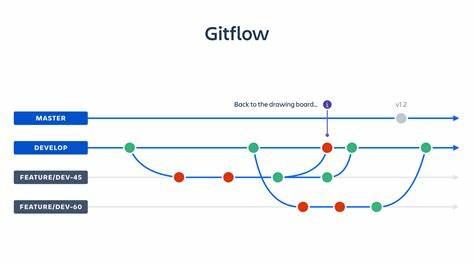

# VGU Alumni By Night WordPress Theme

This is a WordPress theme for the VGU Alumni By Night website.

## Useful Links

1. [Theme Handbook](https://developer.wordpress.org/themes/)
2. [Hosting Local Wordpress](https://youtu.be/usoJ6ckzUz8?si=05eV6Hcyr-3xrSwc)

## Git Workflow

Please follow the following git workflow when working on this project.

**Any questions, please ask.**

### Steps

1. Clone the repository
2. Create a new branch and checkout to it
3. Make changes
4. Add and commit changes
5. Push changes to the remote repository
6. Create a pull request
7. Merge the pull request (if approved)

8. Before you start working on a new feature, make sure to pull the latest changes from the remote repository.